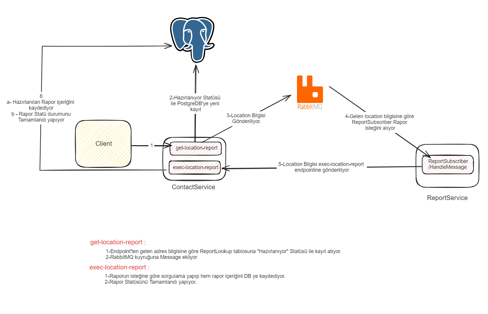

# Utilities

-RabbitMQ

-PostgreSQL

-.net7

## Getting Started

-Projede kullanılan mimariler
  
  -EventDriven
  
  -Dependency Injection
  
  -Repository Design Pattern
  
  -Entity Framework Code First 
  
-Rapor Oluşturma Mimarisi

  

  
-Başlarken:
  
  -Eğer Docker Compose ile container üzerinde çalıştırılacaksa herhangi bir configürasyona gerek yok.Projenin bulunduğu aşağıdaki cmd komutunun çalıştırılması yeterlidir.
	  
	  docker-compose up --build
  
  -Docker Compose dosyasında report service başlangıçta bir kaç kere restart atabilir. RabbitMQ tam ayaklanmadığı için hata verdiğinden restart atabilir.
  
  -ContactService ve ReportService çalıştıktan sonra aşağıdaki URL den erişebilirsiniz.
     
	 ContactService : http://localhost:49154/swagger/index.html
	 
	 ReportService  : http://localhost:49282/swagger/index.html
  
  -Eğer Local olarak çalıştırılacaksa:
  
	  Öncelikle app.settings dosyaları içerisinde bulunan DB configuration ve RabbitMQ configuration ayarları yapılması gerekmektedir.
	  
	  Sonrasında Code first işlemleri için gerekli komutlar ContactService.Contact.Repository.Models altında bulunan ApplicationContext içerisinde açıklama satırı olarak vardır.
	  
## Usage

### Kişi Ekleme (ContactController)(Post)(ReturnValue : bool)
  -api/add-new-person endpointinden yeni kişi ekleyebilirsiniz. Örnek JSON
  
	  {
	    "name": "Ömer",
	    "surName": "Atila",
	    "corparete": "Rise Technology" 
	  }
	  
### Kişi Silme (ContactController)(Post)(ReturnValue : bool)
  -api/delete-person endpointinden var olan kişiyi silebilirsiniz. Örnek JSON
  
	  {
	    "id": 1 
	  }
	  
### Kişiye Contact Bilgisi Ekleme (ContactController)(Post)(ReturnValue : bool)
  -api/add-contact-info endpointinden kişiye contact bilgisi ekleyebilirsiniz. Örnek JSON
  
	  {
	    "idPerson": 1, //Kullanıcı id
	    "contactType": 1, //Phone=1,Mail=2,Location=3
        "content": "02161234567"      
      }

### Contact Bilgisi Silme (ContactController)(Post)(ReturnValue : bool)
  -api/delete-contact-info endpointinden contact bilgisi silebilirsiniz. Örnek JSON
  
	  {
	    "id": 1 
	  }
	  
### Tüm Kişilerin Listesini Çekme (ContactController)(Get)(ReturnValue : List<Person>)
  -api/get-people endpointinden sistem var olan tüm kişileri çekebilirsiniz. Örnek Response JSON
  
	  {[
		{
			"idPerson": 1,
			"name": "Ömer",
			"surName": "Atila",
			"corparete": "Rise Technology"
		},
		{
			"idPerson": 2,
			"name": "Ahmet",
			"surName": "TestSoyad",
			"corparete": "Test Şirketi"
		},
	  ]}
	  
### Kişi Bilgisi ve Contact Bilgisi Çekme (ContactController)(Get)(ReturnValue : PersonContactInfoResponse)
  -api/get-person-info/{id} endpointinden contact bilgisi silebilirsiniz. Örnek Response JSON
  
	  {
	    "person": {
			"idPerson": 1,
			"name": "Ömer",
			"surName": "Atila",
			"corparete": "Rise Technology"
	    },
	    "contacInfos": [
			{
			  "idContactInfo": 1,
			  "idPerson": 1,
			  "contactType": 1,
			  "content": "05531234567"
			},
			{
			  "idContactInfo": 2,
			  "idPerson": 1,
			  "contactType": 2,
			  "content": "atila888@test.com"
			}
	    ]
	  }
	  
### Adres Bazlı Rapor Oluşturma (ContactController)(Get)(ReturnValue : bool)
  -api/get-location-report/{location} gelen parametre adresinden, adrese bağlı o adreste kaç kişi var ve o adreste kaç kişinin telefon numarası olduğu raporunu hazırlayan endpoint.
  
### Rapor Listesini Çekme (ReportController)(Get)(ReturnValue : List<ReportLookup>)
  -api/get-report-list endpointinden sistemin hesapladığı veya hesaplamaya başladığı rapor listesini çekebilirsiniz. Örnek Response JSON
  
	  [
		{
			"idReportLookup": 1,
			"location": "İstanbul",
			"requestDate": "2023-12-26T12:24:44.861Z",
			"statu": "Tamamlandı"
		},
		{
			"idReportLookup": 2,
			"location": "Mersin",
			"requestDate": "2023-12-25T12:24:44.861Z",
			"statu": "Hazırlanıyor"
		}
	  ]
	  
### Raporun İçerik Bilsini Çekme (ReportController)(Get)(ReturnValue : List<ReportContent>)
  -api/get-report-list-detail/{id} endpointinden sistemin hesapladığı veya hesaplamaya başladığı rapor listesini çekebilirsiniz. Örnek Response JSON
  
	  [
		  {
			"idReportContent": 1,
			"location": "İstanbul",
			"personCount": 3,
			"phoneCount": 5
		  }
	  ]